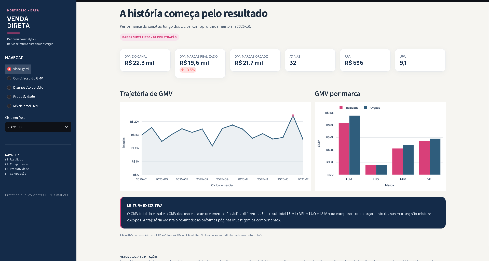
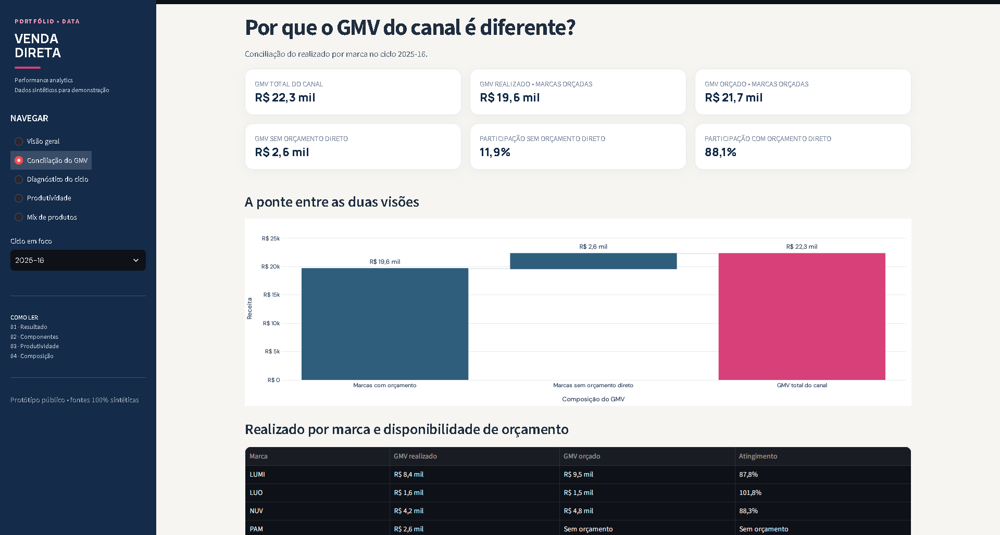
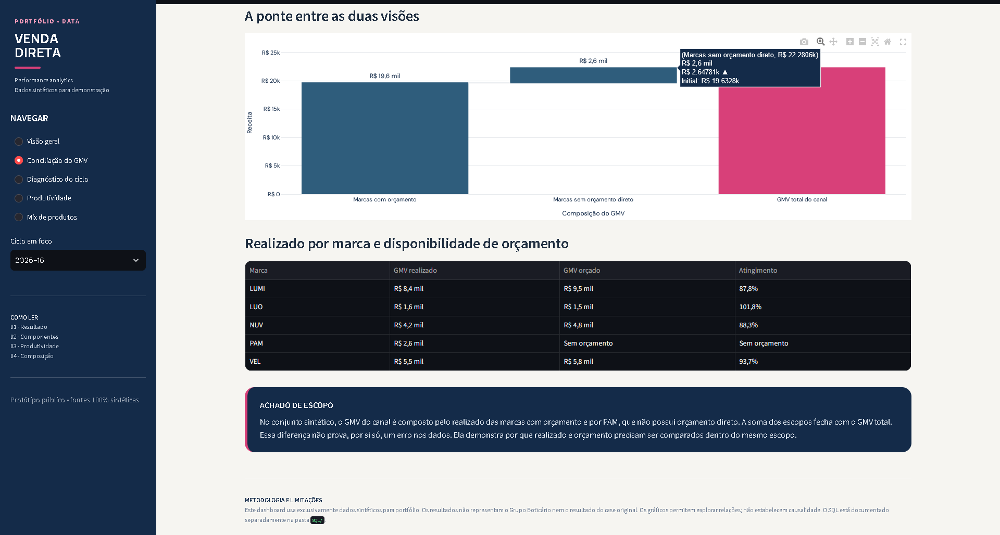
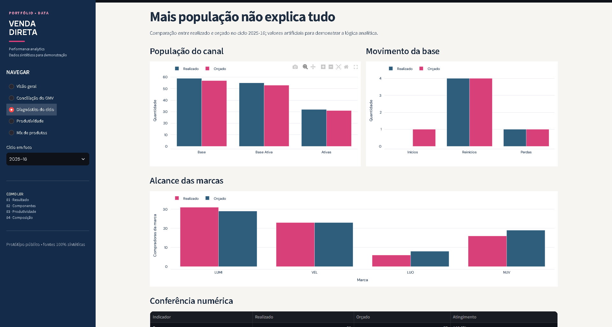
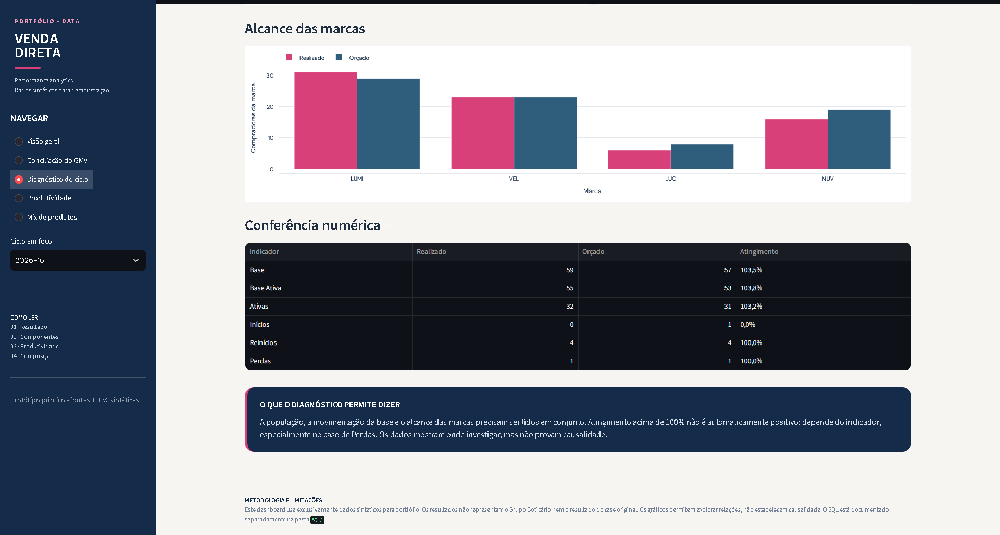
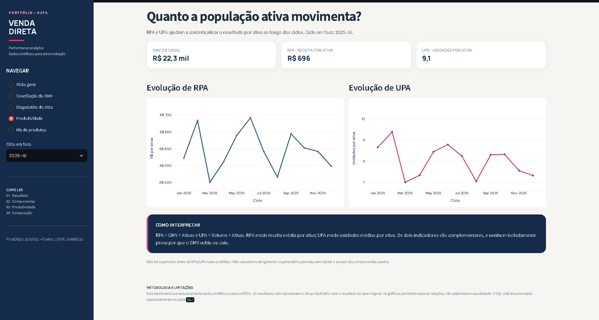
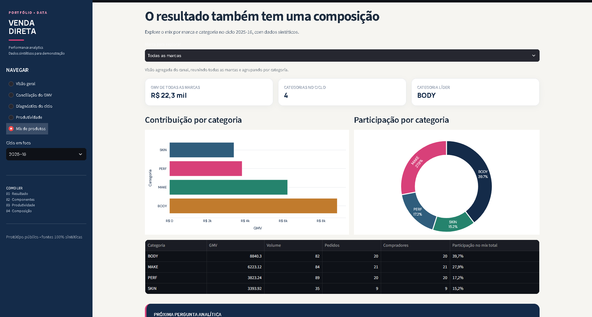

# Dados & Analytics | Performance em Venda Direta

Projeto de portfólio que demonstra uma abordagem de análise de performance em um canal de venda direta, combinando exploração de dados, modelagem analítica, validações de qualidade, comparação entre realizado e orçamento e visualização interativa.

> **Importante:** este é um estudo demonstrativo com dados, identificadores, marcas e valores inteiramente sintéticos. Não representa resultados reais de nenhuma empresa. As regras específicas de simulação estão documentadas abaixo e nos arquivos do projeto.

## Objetivo do projeto

Investigar como a performance do canal evolui por ciclo comercial e como distinguir indicadores de escopo total do canal daqueles que se referem somente às marcas contempladas no orçamento. O estudo também observa a composição do mix, a atividade da base e a produtividade das revendedoras.

Perguntas analíticas exploradas:

- Como evoluem o GMV e o volume por ciclo?
- Como o realizado das marcas orçadas se compara ao orçamento correspondente?
- Como a diferença entre o GMV do canal e o GMV das marcas orçadas deve ser interpretada sem misturar escopos?
- Como variam base, base ativa, ativas, inícios, reinícios e perdas?
- Como se distribuem GMV e volume entre marcas e categorias?
- Que cuidados de granularidade, integridade referencial e definição de indicadores são necessários para evitar conclusões incorretas?

## Dashboard interativo

O dashboard foi desenvolvido em **Streamlit**, com **Pandas** para tratamento dos dados e **Plotly** para visualizações. Ele contém cinco áreas:

1. **Visão geral:** indicadores principais e evolução por ciclo.
2. **Conciliação do GMV:** leitura da diferença entre GMV total do canal, GMV das marcas com orçamento e orçamento dessas marcas.
3. **Diagnóstico do ciclo:** análise dos indicadores do ciclo selecionado.
4. **Produtividade:** leitura de métricas de produção e atividade.
5. **Mix de produtos:** composição por marca e categoria.

### Execução local

Na raiz do repositório, execute:

```bash
pip install -r dashboard/requirements.txt
streamlit run dashboard/app.py
```

O dashboard lê os CSVs sintéticos da pasta `data/`. A versão atual não exige credenciais do BigQuery e não executa consultas pagas para exibir as páginas.

### Acessar o dashboard publicado

[**Abrir o dashboard interativo no Streamlit**](https://case-dados-analytics-venda-direta-igqqlepevblogaks2qkdec.streamlit.app/)

Explore as cinco páginas da aplicação: Visão geral, Conciliação do GMV, Diagnóstico do ciclo, Produtividade e Mix de produtos. O dashboard utiliza exclusivamente os dados sintéticos presentes neste repositório.

## Prévia do dashboard

Todas as visualizações abaixo usam dados sintéticos e demonstrativos.

### Visão geral


### Conciliação do GMV




### Diagnóstico do ciclo




### Produtividade


### Mix de produtos


## Arquitetura do projeto

```text
data/generate_synthetic_data.py
             │
             ▼
     CSVs sintéticos (data/)
        ┌────┴─────┐
        ▼          ▼
 Dashboard       Scripts SQL
 Streamlit       BigQuery Standard SQL
 Pandas/Plotly   auditoria e tabelas analíticas
```

**Nota de implementação:** no estado atual, o dashboard lê diretamente os CSVs sintéticos. Os scripts SQL documentam uma implementação analítica separada para auditoria e criação de tabelas no BigQuery; o dashboard ainda não consome as tabelas materializadas no BigQuery. Essa separação evita sugerir uma integração que não existe nesta versão.

## Fontes sintéticas e granularidade

| Fonte | Granularidade esperada | Conteúdo principal |
|---|---|---|
| `raw_pedidos.csv` | Ciclo + pedido + revendedora + SKU | GMV, volume, desconto, data e meio de captação |
| `raw_base.csv` | Ciclo + revendedora | Flags de base, base ativa, início, reinício e perda |
| `raw_materiais.csv` | SKU | Marca fictícia e categoria |
| `raw_cadastro.csv` | Revendedora | Atributos cadastrais simulados |
| `raw_orcamento.csv` | Ciclo + KPI + marca | Valores orçados sintéticos |

### Marcas da simulação

| Marca fictícia | Escopo no cenário sintético |
|---|---|
| `LUMI` | Possui orçamento |
| `VEL` | Possui orçamento |
| `LUO` | Possui orçamento |
| `NUV` | Possui orçamento |
| `PAM` | Sem orçamento; pode ter GMV realizado nos pedidos |

PAM permanece fora da comparação realizado versus orçado porque não há orçamento sintético para essa marca. A ausência de orçamento não deve ser preenchida com um valor inventado.

## Indicadores e regras de interpretação

- **GMV:** valor vendido registrado nas linhas de pedido, agregado conforme o escopo analítico.
- **Volume:** quantidade de unidades vendidas.
- **Ativas:** revendedoras distintas com pedidos no ciclo, conforme esta simulação.
- **RPA:** GMV total do canal dividido pelas ativas totais do canal.
- **UPA:** volume total do canal dividido pelas ativas totais do canal.
- **Penetração da marca:** compradores distintos da marca divididos pelas ativas totais do canal.
- **Comparação realizado versus orçado:** feita somente para combinações de ciclo, KPI e marca com orçamento correspondente.

Os nomes dos indicadores preservam a terminologia usada na documentação do projeto. A forma de cálculo aplicada nesta simulação é descrita nos scripts SQL e no código do dashboard; deve ser avaliada no contexto sintético, não como regra oficial de uma empresa.

## Camada SQL

A pasta [`SQL/`](SQL/) contém scripts para BigQuery Standard SQL, organizados na seguinte ordem:

1. `01_auditoria_fontes.sql`: contagem, completude, duplicidade, integridade referencial, domínios e checagem dos rótulos de marca.
2. `02_tabelas_analiticas.sql`: criação das tabelas analíticas por ciclo, por ciclo e marca, e por ciclo, marca e categoria.
3. `03_realizado_x_orcado.sql`: comparação entre realizado e orçamento nas combinações compatíveis.

### Granularidade das tabelas analíticas

- `analitico_canal_ciclo`: uma linha por ciclo.
- `analitico_marca_ciclo`: uma linha por ciclo e marca.
- `analitico_mix_ciclo`: uma linha por ciclo, marca e categoria.
- `realizado_x_orcado_ciclo`: uma linha por ciclo, KPI e marca quando existe orçamento correspondente.

### Preparar o BigQuery

1. Crie um dataset de portfólio.
2. Carregue os cinco CSVs como tabelas `raw_pedidos`, `raw_base`, `raw_materiais`, `raw_cadastro` e `raw_orcamento`.
3. Em cada script, substitua `SEU_PROJETO.SEUDATASET` pelo seu identificador de projeto e dataset.
4. Execute os scripts na ordem indicada acima.

Os scripts estão preparados para a versão sintética, mas não se afirma aqui que tenham sido executados ou validados em um ambiente BigQuery específico.

## Gerar novamente os dados

Com Python 3 instalado, execute na raiz:

```bash
python data/generate_synthetic_data.py
```

O gerador usa apenas a biblioteca padrão do Python e uma semente fixa para permitir a reprodução da simulação.

## Premissas e limitações

- Todos os registros, identificadores, marcas e valores são sintéticos.
- O ciclo `202516` contém desvios configurados intencionalmente para permitir demonstrar a leitura de variações; esses valores não representam resultados reais.
- A simulação de reinício usa uma janela de sete posições de ciclo sem compra. Trata-se de uma aproximação didática, não de uma regra oficial de negócio.
- RPA e UPA não têm orçamento direto nesta simulação.
- Não se deve comparar GMV total do canal com orçamento que cobre apenas um subconjunto de marcas.
- Os CSVs alimentam o dashboard; os scripts SQL representam a camada analítica de demonstração em separado.

## Estrutura do repositório

```text
.
├── data/
│   ├── generate_synthetic_data.py
│   ├── raw_pedidos.csv
│   ├── raw_base.csv
│   ├── raw_materiais.csv
│   ├── raw_cadastro.csv
│   └── raw_orcamento.csv
├── SQL/
│   ├── 01_auditoria_fontes.sql
│   ├── 02_tabelas_analiticas.sql
│   ├── 03_realizado_x_orcado.sql
│   └── README.md
├── dashboard/
│   ├── app.py
│   ├── requirements.txt
│   └── README.md
└── README.md
```

## Sobre

Desenvolvido por **Jéssica Prata Borges** como projeto de portfólio em Analytics, com foco em qualidade de dados, granularidade, indicadores de negócio, SQL, Python e comunicação analítica.
